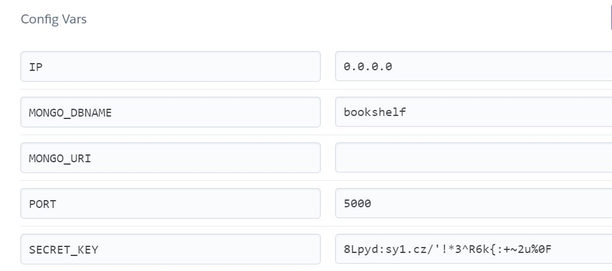
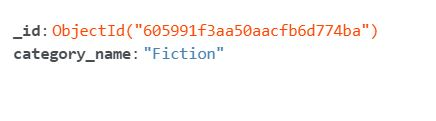
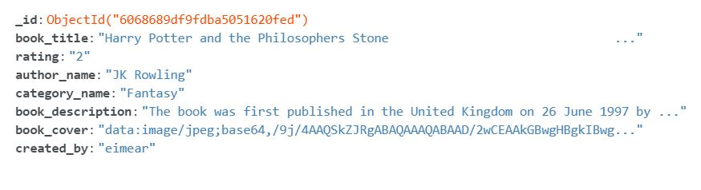
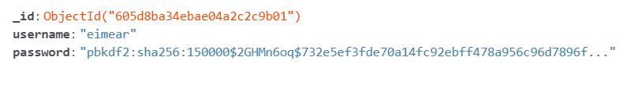
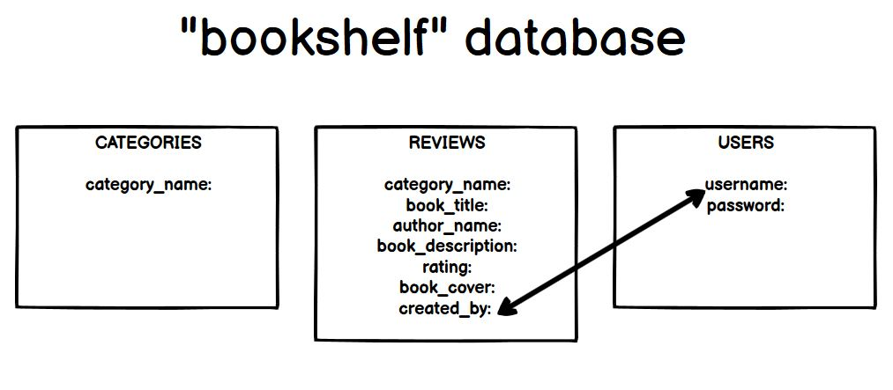

# On My Bookshelf - An online community for book lovers
A website for users to upload book reviews, and browse other peoples book reviews.

Live website: https://on-my-bookshelf-ms3.herokuapp.com/

# UX
### Who this website is for:
* This website is for people interested in reading who want to share book reviews with others & upload their own book reviews.

### What they want to achieve:
* They want to browse through book reviews & add their own book reviews.

### This project is the best way to help them achieve these things because:
* From the homepage, the user can easily browse through book reviews without having to register / login.
* Once logged in the user has the opportunity to easily upoad their own book reviews by filling out a short form.

## User Stories:
1. As a user, I want to browse through book reviews and find more information on each book.
2. As a user, I want to search for a book/author in the reviews.
3. As a user, I want to be able to register and create an account on the site.
4. As a user, I want to be able to upload my own book reviews to the site.
5. As a user, I want to be able to login to the site and view my profile.
6. As a user, I want to be able to edit / delete the reviews I have uploaded. 

## Design 
### Color Scheme 
I decided to keep the color scheme of the site neutral and clean
- A light grey/lilac (#d1d1e0) was used as the background color for the site 
- A soft peach (#e8e4e3) was used as the background color for the review cards, to compliment the page background
### Typography 
- Google Font [Kiwi Maru](https://fonts.google.com/specimen/Kiwi+Maru) was used as the font type across the site. I thought this everyday text complimented the casual and clean style of the site.

## Wireframes:
- Wireframes for 3 screen sizes (Desktop, tablet and mobile).

    [Desktop](https://github.com/EimearCunningham/milestone-three/blob/master/static/images/readme-images/wireframes/wireframe-desktop.pdf)

    [Tablet](https://github.com/EimearCunningham/milestone-three/blob/master/static/images/readme-images/wireframes/wireframe-tablet.pdf)

    [Mobile](https://github.com/EimearCunningham/milestone-three/blob/master/static/images/readme-images/wireframes/wireframe-mobile.pdf)

# Features
### Navigation bar
- The navigation bar at the top of each page allows the user to easily get to each section of the site.
- Depending on whether the user is logged in/not, the navigation bar will display different options:
    * If user is not logged in the navigation bar will display the options: Home, Register, Login.
    * If the user is logged in the navigation bar will display the options: Home, Add Review, Profile, Logout.
- The logo in the top left corner will bring the user to the homepage, as expected.

### Homepage
- The homepage will display the navigation bar at the top of the page.
- A large hero image will be displayed underneath the navigation bar.
- There will be a text overlay to let users know the sites function.
- A search bar will be placed over the hero image to allow users to search through the reviews below.
- All uploaded book reviews will be displayed on the homepage.
- If a user is logged in, the book reviews they have uploaded themselves will have the options "Edit" and "Delete".

### Registration Page
- The login page will display the naviagation bar at the top of the page.
- The page will contain a form with two inputs - "Username" and "Password", and a "Register" button.
- When ths user selects the "Register" button and succesfully createas a profile, they will be redirected to their own new Profile.

### Login Page
- The register page will also display the navigation bar at the top of the page.
- Users will be able to login to their account by submitting a form with their username and password, and selecting a "Login" button.
- On selecting the 'Login' button users will be directed to their profile page.

### Add Review Page
- Again, the navigation bar will be visible at the top of this page.
- Only logged in users will be able to access the "Add Review" section.
- Users will be able to complete a form and submit a book review.
- On submitting a review, the user will be directed to the homepage of the site where their review will be added.

### Edit Review Page
- Users will be able to edit any reviews they created themselves.
- The option will be available on the review displayed on the homepage and on the users profile page.
- When the 'Edit Review' button is selected, the user will be brought to a form that is prepopulated with the reviews information.
- The user will have the option to edit each field of the information and then submit the form to edit the review.

### Delete Review functionality
- Users will be able to delete any review that they uploaded, should they not want it shown on the site anymore.
- They will have the option to 'Delete Review' from their profile page or the site homepage.
- When selected, the review will be deleted.

### User Profile Page
- Logged in users will be able to navigate to their own unique profile.
- Their profile will display all of they book reviews they uploaded.
- From here, users will be able to View Edit and Delete reviews that they uploaded.

### Logout functionality
- When logged in, users will have the option to 'Logout' displayed on the navbar.
- When selected the user will be logged out from their account.

### Features Left to Implement
- **Known Issue** - A not logged in user has the ability to delete a review when only the user who created the review should be able to access this link. Because the link includes the object ID this is extremely unlikely to happen so I decided not to implement defensive programming for this issue, although it is something I hope to add in the future.
- I would also like to add the functionality for the site creator to be able to login as an administrator and edit the book categories.
- Functionality to add a 'Retype password' input to the Registration page to be added in the future.

# Technologies Used
## Languages, frameworks and libraries used
* HTML5, CSS3, Javascript, Python and Jinja were the programming languages used for this project.
* [Github](https://github.com/) - Used for hosting my repository and version control
* [Bootstrap 4](https://getbootstrap.com/docs/4.0/getting-started/introduction/) - Bootstrap version 4 was used for layout and responsiveness purposes.
* [jQuery](https://jquery.com/)- jQuery was used to create the 'Scroll to top' button, and the flash message timeout.
* [Font Awesome](https://fontawesome.com/) - Used for Star icons as part of book review cards, and username and password inputs on login & register forms.
* [Flask](https://flask.palletsprojects.com/en/1.1.x/) - Flask framework used to create app. 
* [Mongo DB Atlas](https://www.mongodb.com/) - Used to create non relational database

## Other technologies used
* [Heroku](http://heroku.com/) - Used to deploy project
* [Balsamiq](https://balsamiq.com/wireframes/) - Desktop app used to create wireframes.
* [Werkzeug](https://werkzeug.palletsprojects.com/en/1.0.x/) - Used to hash users passwords.

# Testing
This can be found in [testing.md](testing.md)

# Deployment
## Project was deployed to Heroku by following these steps:
1. Set up files that Heroku needs
    - A requirements.txt file to specify what python packages are required to run the project. Create in terminal: `pip3 freeze --local > requirements.txt`
    - a Procfile that specifies the commands that are executed by the app on startup. Also created in terminal: `echo web: python app.py > Procfile`

2. Create Heroku app
    - Go to [Heroku](https://www.heroku.com/) and create an account.
    - Select the button to create a new app.
    - Name app and select 'Europe' as region.

3. Connect Github repository to Heroku
    - Once app is created select 'Connect to GitHub' button.
    - Search for Github repository name - 'milestone-three'
    - Once found select to 'Connect'

4. Set up configuration vars on Heroku
    - Go to 'Settings' tab of Heroku app
    - Select 'Reveal config vars'
    - Input the following keys and values. Note: MONGO_URI is left blank for now.
    

5. Push requirements.txt and Procfile to Github
    - git add & git commit both files
    - git push both files together 

6. Enable automatic deployment
    - Go to Heroku app
    - Select 'Enable automatic deploys' followed by 'Deploy branch'
    - This will take a couple of minutes before showing 'Your app was succesfully deployed'

## Connecting to MongoDB Atlas
MongoDB Atlas is the non-relational database used for storing data for this app. I set up the database by following these steps:
### Databate setup:
- Create MongoDB account
- Create shared cluster
- Create database called 'bookshelf'
- Go to 'Collections' section of database and select 'Add my own data'
- Create 3 collections - categories, reviews, users
- Insert documents to categories collection - One document for each category of books, as shown: 
- Insert document to reviews collection as shown: 
- Users are stored in the database as shown: 
- Database schema: 

# Credits

## Code
* Regex used to validate book cover URL was retrieved from [Stack Overflow](https://stackoverflow.com/questions/3809401/what-is-a-good-regular-expression-to-match-a-url)
* Code for Scroll to Top button was found on [w3 Schools](https://www.w3schools.com/howto/howto_js_scroll_to_top.asp)
## Content
* [Icon Archive](https://iconarchive.com/tag/favicon-book) - Provided the favicon for the page
## Media
* [Unsplash.com](https://unsplash.com/Unsplash.com) - Provided hero image for homepage
## Acknowledgements
- I would like to thank my mentor Can Sucullu for helping me out with the initial stages of this project
- I would also like to thank Chris Quinn for stepping in as my mentor for the final stages of this project
- The Code Institute slack community for always helping out and encouraging along the way
- Tim from Tutor Support for helping out with some issued with the users profile page

**This site is for educational purposes only** 

BUGS:
Validation on select category dropdown - Add value="" to <option selected disabled value="">Select Category</option>